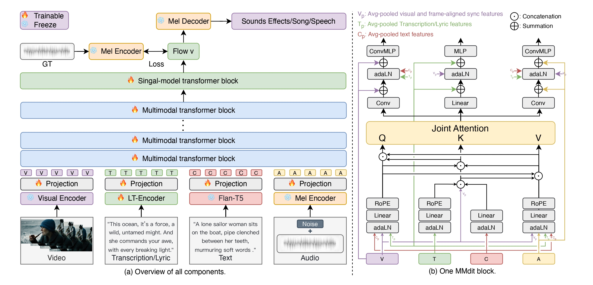

<h1 align="center">AudioGen-Omni: A Unified Multimodal Diffusion Transformer for Video-Synchronized Audio, Speech, and Song Generation</h1>

<div align='center'>
  <span class="author-block">Le Wang<sup>1</sup><sup>*</sup>, Jun Wang<sup>*</sup>, Feng Deng<sup>*</sup>, Cheng Zhang<sup>*</sup>,  Kun Gai<sup>*</sup>, Di Zhang<sup>*</sup></span>
</div>

<div align='center'>
  <span class="author-block"><strong><sup>1</sup>China University of Mining and Technology, </strong></span>
  <span class="author-block"><strong><sup>*</sup>Kuaishou Technology</strong></span>
</div>
<br>

<div align="center">

  <!-- 📄 Paper / project / GitHub stats -->
  <p>
    <a href="-" target="_blank"></a>&nbsp;
    <a href="https://github.com/ciyou2/AudioGen-Omni/" target="_blank"></a>&nbsp;
    &nbsp;
    <a href="https://github.com/ciyou2/AudioGen-Omni" target="_blank"></a>
  </p>

  <!-- 🎬 Showcase -->
  <p></p>
  <p>🔥 For more results, visit our <a href="https://ciyou2.github.io/OmniGen/" target="_blank"><strong>Demo page</strong></a> 🔥</p>

</div>

## Introduction 📖
We present AudioGen-Omni — a unified approach
based on multimodal diffusion transformers (MMDit),
capable of generating high-fidelity audio, speech, and
songs coherently synchronized with the input video.
AudioGen-Omni introduces a novel joint training
paradigm that seamlessly integrates large-scale video-
text-audio corpora, enabling a model capable of gener-
ating semantically rich, acoustically diverse audio con-
ditioned on multimodal inputs and adaptable to a wide
range of audio generation tasks. AudioGen-Omni em-
ploys a unified lyrics-transcription encoder that en-
codes graphemes and phonemes from both sung and
spoken inputs into dense frame-level representations.
Dense frame-level representations are fused using an
AdaLN-based joint attention mechanism enhanced with
phase-aligned anisotropic positional infusion (PAAPI),
wherein RoPE is selectively applied to temporally struc-
tured modalities to ensure precise and robust cross-
modal alignment. By unfreezing all modalities and
masking missing inputs, AudioGen-Omni mitigates the
semantic constraints of text-frozen paradigms, enabling
effective cross-modal conditioning. This joint training
approach enhances audio quality, semantic alignment,
and lip-sync accuracy, while also achieving state-of-the-
art results on Text-to-Audio/Speech/Song tasks. With an
inference time of 1.91 seconds for 8 seconds of audio,
it offers substantial improvements in both efficiency and
generality.
 
## Citation
```
@misc{AudioGen-Omni,
      title={AudioGen-Omni: A Unified Multimodal Diffusion Transformer for Video-Synchronized Audio, Speech, and Song Generation},
      author={Le Wang, Jun Wang, Feng Deng, Chen Zhang, Di Zhang, Kun Gai},
      journal={arXiv preprint arXiv:-},
      year={2025}
}
```
